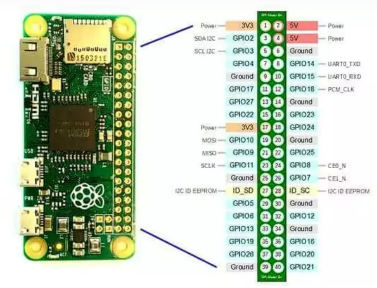
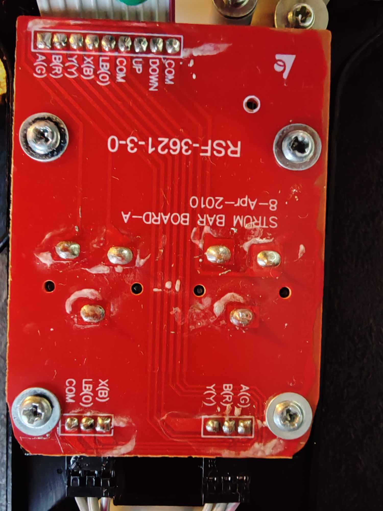

# PyS3Hero - A Clone Hero Guitar Controller made with RasPi Zero

Controller used : Guitar from Guitar Hero Warriors of Rock - PS3 Model (GH6:WoF)

## Raspberry Pi Zero - GPIO



## Raspberry pi zero - Prepare

```sh
# The library for use the Gpio on Raspberry Pi Zero
sudo apt-get -y install rpi.gpio python3-gpiozero
# Joystick_8.py = library for joystick
# Update your raspberry pi firmware : 
sudo raspi-update
sudo reboot
# OBSOLETE : Config your Pi to be used as a Controller
# sudo echo "dwc2" | sudo tee -a /etc/modules
# sudo echo "libcomposite" | sudo tee -a /etc/modules
# You don't have to edit the /boot/config.txt now it's the /boot/firmware/config.txt
# add this line above dtoverlay=vc4-kms-v3d
dtoverlay=dwc2
# and comment this line
#otg_mode=1
# Now we are ready for the rumble :
sudo cp 8_buttons_joystick_usb /usr/bin
sudo chmod +x /usr/bin/8_buttons_joystick_usb
# Edit the /etc/rc.local file and add this line above "exit 0"
/usr/bin/8_buttons_joystick_usb
# Just reboot and your rpi zero will be detected as Joystick ! 
```

## GH Warriors of Rock - Strum Bar card



The Guitar Hero Warriors of Rock Controller is pretty simple, only digital pin. So you just had to wire the different buttons to the raspberry pi and it's done !

## GH Warriors of Rock - Whammy Bar 

Soon...

## Credit

[Milador](https://github.com/milador) : https://github.com/milador/RaspberryPi-Joystick

[TuxComputers](https://github.com/tuxcomputers) : https://github.com/tuxcomputers/pizero_usb_device
